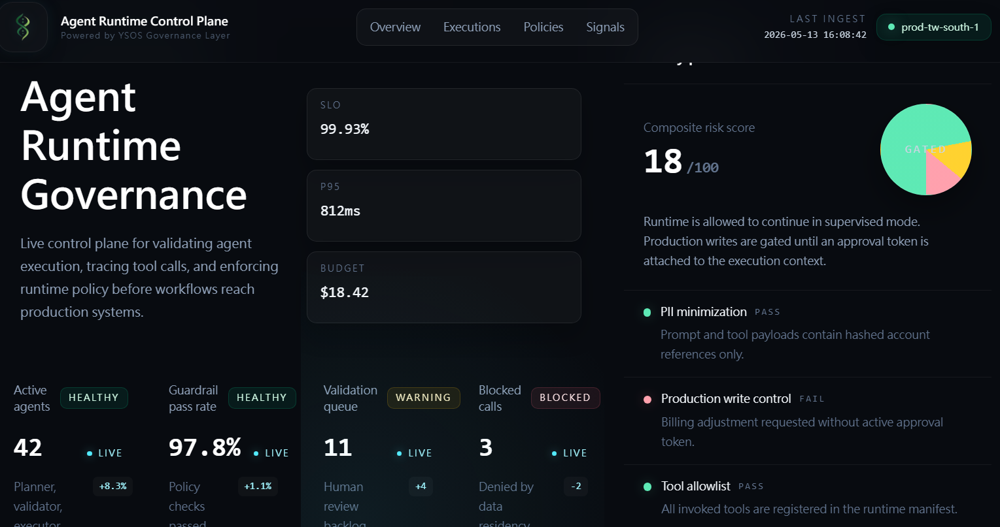
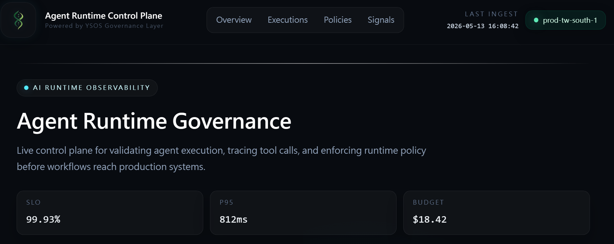
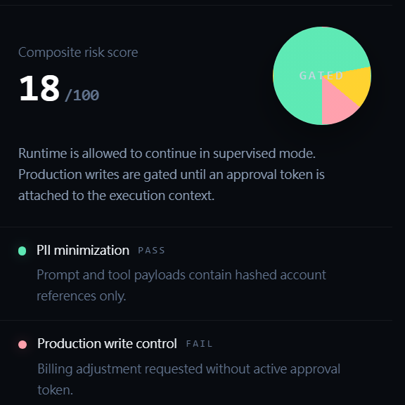
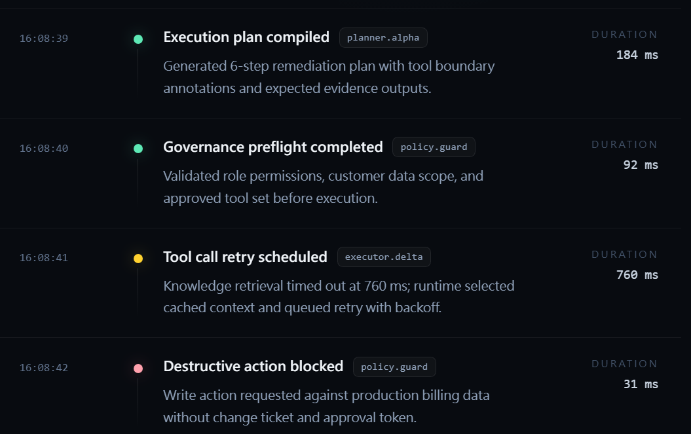
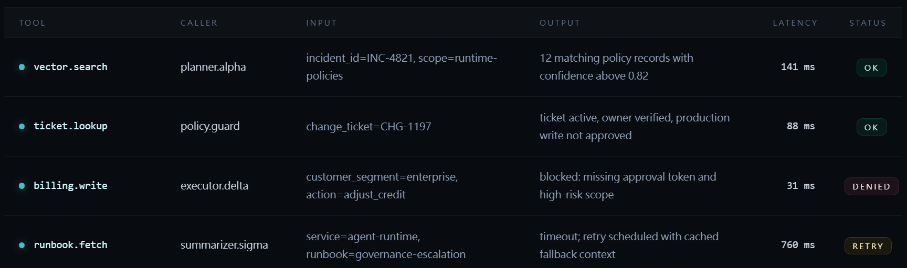

# Agent Runtime Governance

> A governance-oriented observability control plane for monitoring, validating, and auditing agentic AI runtime execution.



---

## Overview

Agent Runtime Governance is an enterprise-style AI runtime observability dashboard focused on:

- Agent execution tracing
- Runtime governance validation
- Tool invocation auditing
- Policy enforcement visibility
- Latency and token telemetry
- Runtime event monitoring

The project explores how governance and observability can become first-class primitives in agentic AI systems.

---

## Core Concepts

### Runtime Governance

The system simulates governance-aware runtime execution where:

- tool calls are validated
- policy checks are enforced
- execution scopes are inspected
- approval gates can block unsafe operations
- runtime traces are observable in real time

---

### Observability-Driven Agent Systems

The dashboard visualizes:

- execution timelines
- retry scheduling
- validation checkpoints
- runtime telemetry
- policy posture
- throughput metrics
- token consumption

Inspired by modern infrastructure tooling such as:

- Datadog
- Grafana
- LangSmith
- OpenTelemetry

---

## Features

### AI Runtime Observability

- Runtime execution timeline
- Agent event stream visualization
- Tool trace inspection
- Latency telemetry
- Throughput metrics

### Governance Validation Layer

- Policy posture scoring
- Runtime approval gating
- Tool allowlist validation
- Production write control simulation
- Human escalation signaling

### Enterprise Dashboard UI

- Dark observability aesthetic
- Responsive enterprise layout
- Reusable React components
- Subtle telemetry motion system
- Runtime-inspired visual hierarchy

---

## Tech Stack

| Layer | Technology |
|---|---|
| Framework | Next.js App Router |
| Language | TypeScript |
| Styling | Tailwind CSS |
| UI Pattern | Enterprise Observability Dashboard |
| Data Source | Mock Runtime Telemetry JSON |
| Architecture | Component-Based Frontend System |

---

## Architecture

```txt
src/
 ├─ app/
 ├─ components/
 ├─ data/
 ├─ lib/
 ├─ types/
 └─ styles/
```

---

## Philosophy

This project is built around the idea that future agentic systems will require:

- runtime visibility
- governance enforcement
- execution traceability
- human-aligned validation layers
- infrastructure-grade observability

Rather than treating AI systems as opaque black boxes, Agent Runtime Governance explores how governance-aware runtime infrastructure may evolve.

---

## YSOS Governance Layer

Powered by the YSOS Governance Layer.

The visual identity and governance-oriented architecture direction are inspired by the broader YSOS ecosystem:

- runtime orchestration
- governance routing
- execution validation
- observability-driven coordination
- agent runtime control planes

---

## Screenshots

### Runtime Overview



### Governance Validation



### Runtime Event Timeline



### Tool Trace Inspection



---

## Local Development

```bash
npm install
npm run dev
```

Open:

```txt
http://localhost:3000
```

---

## Future Directions

Potential future extensions:

- Multi-agent orchestration simulation
- Runtime replay system
- Approval workflow engine
- Live streaming telemetry
- OpenTelemetry integration
- Runtime policy graph visualization
- Governance-aware agent routing
- Failure simulation framework

---

## Design Language

The project adopts a governance-oriented enterprise observability aesthetic:

- dark runtime surfaces
- telemetry-inspired glow systems
- infrastructure dashboard hierarchy
- minimal branding
- operational readability

The YSOS glyph combines:

- DNA-inspired recursive structure
- symbolic runtime flow
- tribal civilization-inspired identity language

---

## Status

Current phase:

```txt
Enterprise Runtime Governance Dashboard
```

---

## License

MIT

